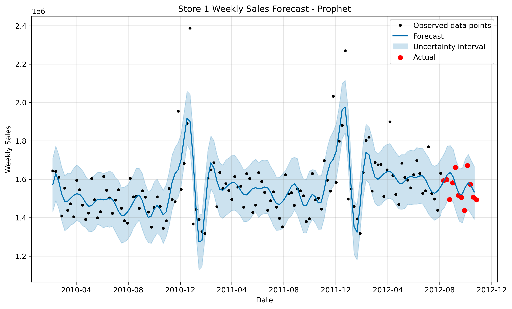

# Capstone-Project-Walmart-Weekly-Sales-Forecasting 

## 📝 Project Overview  
Walmart, one of the largest retail chains in the world, operates **45 stores** with weekly sales data collected over multiple years.  
The sales are influenced by **holidays, economic conditions, and seasonal trends**, making forecasting both challenging and crucial.  

This capstone project develops a **hybrid forecasting system** using:  
- **Traditional Time Series Models** (SARIMA, Holt-Winters, Prophet)  
- **Machine Learning Models** (Linear Regression, Random Forest, XGBoost)  

The aim is to **forecast weekly sales per store** and provide **business insights** to optimize:  
- 📦 **Inventory planning**  
- 🚚 **Supply chain logistics**  
- 💰 **Revenue management**  

---

## 🎯 Objectives  
- Perform **Exploratory Data Analysis (EDA)** to identify sales drivers.  
- Forecast weekly sales using **per-store Time Series models**.  
- Build **ML models with economic indicators + store features**.  
- Compare models with **RMSE, MAE, R²** metrics.  
- Provide **data-driven business recommendations** to Walmart.  

---

## 📂 Dataset  
The dataset contains **6,435 rows × 8 columns**.  

| Column          | Description |
|-----------------|-------------|
| **Store**       | Store ID (1–45) |
| **Date**        | Week of sales |
| **Weekly_Sales**| Sales for the store that week |
| **Holiday_Flag**| Holiday week? (1 = Yes, 0 = No) |
| **Temperature** | Average temperature (°F) |
| **Fuel_Price**  | Regional fuel price |
| **CPI**         | Consumer Price Index |
| **Unemployment**| Regional unemployment rate |

📌 **Data Range:** 2010–2012 (Weekly frequency)  
📌 **Granularity:** Store-level weekly sales  

---

## 🔍 Exploratory Data Analysis (EDA)  

Key insights from EDA:  
- 🏬 **Store Differences** → Store 20 & Store 4 are consistent top performers.  
- 🎉 **Holiday Effect** → Some holidays (e.g., Thanksgiving, Christmas) spike sales, others have little impact.  
- 💡 **Economic Drivers** → CPI & Unemployment show negative correlation with sales.  
- 📅 **Seasonality** → Clear yearly seasonality with peaks in Q4 (Nov–Dec).  

📊 **Visuals Created**  
- Correlation Heatmap (CPI, Fuel, Unemployment vs Sales)  
- Store-wise performance plots  
- Holiday vs Non-Holiday comparison  
- Seasonal trends (monthly, weekly)  

---

## ⚙️ Methodology  

### **1️⃣ Time Series Models (Per Store)**  
Each store modeled separately:  
- **SARIMA**: Seasonality + Autoregression  
- **Holt-Winters**: Trend + Seasonal smoothing  
- **Prophet (Facebook)**: Captures holiday & trend effects easily  

### **2️⃣ Machine Learning Models (All Stores)**  
Features engineered:  
- **Date-based**: Year, Month, Week, Holiday_Flag  
- **Economic**: Temperature, Fuel_Price, CPI, Unemployment  
- **Store ID**: One-hot encoded  

Models applied:  
- **Linear Regression** (baseline)  
- **Random Forest** (non-linear patterns)  
- **XGBoost** (gradient boosting, best performance)  

---

## 📈 Results  

### 🔮 Model Performance  

| Model             |   RMSE ↓ |   MAE ↓  | R² ↑ |   Notes                    |
|-------------------|----------|----------|------|----------------------------|
| SARIMA            | 41649.32 | 32951.71 | —    | Good for short-term, noisy |
| Holt-Winters      | 54118.55 | 43378.99 | —    | Smooth, stable             |
| Prophet           | 64612.44 | 51774.3  | —    | Best Time Series model     |
| Linear Regression | 132008.65| 98948.48 | 0.94 | Weak baseline              |
| Random Forest     | 70083.15 | 49368.66 | 0.98 | Handles non-linearities    |
| XGBoost           | 61829.55 | 43506.87 | 0.98 |  **Best ML model**         |

✅ **Best Time Series Model:** Prophet  
✅ **Best ML Model:** XGBoost  
✅ **Overall:** XGBoost gives **highest accuracy**, Prophet is most **interpretable**  

---

## 📊 Visualization Examples  

### Prophet Forecast (Store Example)
  

### Model Comparison (RMSE)
  

---

## 💡 Business Insights  

1. **Inventory Planning**  
   - Stock more in **Nov–Dec holiday period**.  
   - Reduce excess stock in **low sales summer weeks**.  

2. **Store Strategy**  
   - Learn from **top stores (Store 20, Store 4)**.  
   - Investigate consistently low-performing stores.  

3. **Economic Sensitivity**  
   - High CPI & Unemployment reduce sales → targeted **discount campaigns** recommended.  

4. **Model Deployment**  
   - **Prophet** for managers → intuitive & interpretable.  
   - **XGBoost** for backend systems → high accuracy at scale.  

---

## 🚀 Tech Stack  

- **Languages**: Python  
- **EDA & Viz**: Pandas, NumPy, Matplotlib, Seaborn  
- **Time Series Models**: statsmodels (SARIMA, Holt-Winters), Prophet  
- **Machine Learning Models**: scikit-learn, XGBoost  
- **Environment**: Jupyter Notebook / Google Colab  

---

## 📂 Repository Structure  
📦 Walmart-Sales-Forecasting
┣ 📂 data/ # Raw & processed datasets
┣ 📂 notebooks/ # Jupyter notebooks for EDA & models
┣ 📂 src/ # Scripts for model training/evaluation
┣ 📂 results/ # Plots, metrics, model outputs
┣ 📜 README.md # Documentation
┣ 📜 requirements.txt # Dependencies
┗ 📜 Walmart.csv # Dataset

---

## 🔮 Future Work  
- Build an **interactive Streamlit dashboard** for managers.  
- Deploy **real-time API** using FastAPI + Docker.  
- Add **external datasets** (promotions, weather, competitor activity).  
- Extend forecasting to **daily-level granularity**.  

---

## 🏆 Conclusion  
This capstone demonstrates the power of combining **classical forecasting methods** with **modern ML models**.  
- **XGBoost** achieved the lowest error rates → making it the most accurate predictor.  
- **Prophet** provided interpretable forecasts → valuable for business teams.  

👉 These insights empower Walmart to **optimize inventory, reduce costs, and boost customer satisfaction** through better sales planning.  

---

## 👨‍💻 Author  
**NEERAJ MITTAL**  
📌 Capstone Project — Walmart Weekly Sales Forecasting  

---

## 📜 License  
This project is licensed under the MIT License.  

